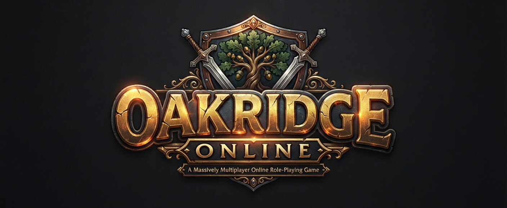

<h1 align="center"></h1>

A free, skill-based MMO that runs in the browser. You click to move on a tile grid in a shared world that advances on a 600 ms game tick. The graphics are simple low-poly 3D, and every model is built in code.

**Play:** https://oakridgeonline.emutastic.com

**Status:** early development. On a test map you can make an account, design a character, walk and chat with other players, pick up, carry, wear and drop items, and train woodcutting, mining and fishing.

## How it works

- **TypeScript on both ends.** `src/shared` holds the map, collision, pathfinding and the network protocol, and both the server and the browser use it.
- **Server** (`src/server`):
  - One Node.js process holds the world in memory and advances it every tick.
  - Clients send intents (for example, "walk to this tile"), and the server validates them and moves everyone.
  - Each player receives only what changed within 15 tiles of them.
  - Transport: JSON messages over a WebSocket at `/ws`.
- **Pathfinding.**
  - A breadth-first search over a 128×128 window that expands neighbours in a fixed order, so walks go straight first, then diagonal.
  - Clicking an unreachable tile walks to the nearest reachable tile.
  - Clicking a tree, rock or fishing spot walks to a tile beside one of its sides (never a corner), where the character turns to face it.
- **Accounts.** Every login is a one-time code from an authenticator app or an email; no passwords are stored.
- **Items.** The server owns a 28-slot inventory, 11 equipment slots and the items lying on the ground. Something a player drops stays theirs alone for a minute before others can see it. Worn items show on the character.
- **Skills.** Fifteen skills level from 1 to 99 on a fixed XP curve, with XP kept in tenths: four combat skills, ranged, magic and prayer, three gathering and five processing.
  - Each skill action rolls on the tick: a tree every 4 ticks, a rock every 8, 7 or 6 ticks depending on the pickaxe, a net every 6. The chance rises with level (and, for woodcutting, with a better axe).
  - Trees fall on a timer that everyone chopping them shares, rocks run out after each ore, and fishing spots move every few minutes; all come back.
  - Other players see who is chopping, mining or fishing, and a level-up sets off fireworks everyone nearby sees.
- **Sound.** Web Audio plays the swing of an axe or pick, a net going in the water, a tree coming down and items being handled, on three channels with their own volumes: what you do, what happens around you (quieter with distance), and music. The level-up flourish is built from tones rather than recorded. `#sounds` on the site plays them all.
- **Music.** Background tracks play in the world in a shuffled order, one after another with a pause between and a fade at either end. They are streamed, not held in memory, and nothing is fetched while the music volume is at nothing.
- **The world.** Absolute tile coordinates on a fixed frame of 64×64 regions, built site by site from one seed on both ends, so no map data travels: the Oakridge district (a village with its bank and shops, a farm, a wood, a quarry, a marsh, a barrow and a stockade); up the North Road, Stonecote, a hamlet astride the river with an inn, a chapel, a tackle shop and a bridge, and under it Stonecote Hollow, a two-room dungeon on its own plane with a chest at the end of it; and past that Thornbury, the walled capital, with four gates, a market square, two banks, a row of shops, a smithy, an inn, a church, twenty houses and a castle, and under its streets a two-plane sewer with a silver seam, a chest and a way out under the walls; and west along the West Road, Wickstead, the fishing village on the Sunder Sound, with the second bank, a net shop, an inn, a manor on the rise, a lock-up, a jetty, alders along the shore and grayling in the beck; and south from it down the Coast Road, Brinehaven, the port on the headland where the Sound meets the open sea, with the third bank, a shop of creels and pots, an inn, the harbourmaster's office, a shipwright's yard with the ferry on the stocks, warehouses, a paved quay with three berths behind a stone mole, and crab beds off the south shore; and east through the Emberway Gate, a toll gate, over the Cinderwaste — red earth, dead trees, scorpions and a pair of highwaymen at a ruined waystation — to Kilnhold, the walled smithing town, with the fourth bank, a blade shop that sells the steel sword and nothing else does, furnaces that run hot enough for the good bars, an inn, houses, the kilns outside its gate and an emberite outcrop by the shore; and under the quarry by Oakridge, the Copperfoot Adit, its bars gone and one plane of old workings behind them with coal seams, bats and a chest; and across the water from Brinehaven, twenty coins to the ferryman, Sablewood Isle: Tarhollow with no bank on purpose, an inn, a store, a chapel, cottages and a jetty with blackfish off it, the ironbark wood, sablewood on the slopes of Mount Sear, and in the mountain's flank the Searmouth, three planes of throat, galleries and heart with the red ore, vents, four creatures of its own and a chest at the bottom. `#stonecote`, `#thornbury`, `#wickstead`, `#brinehaven`, `#kilnhold`, `#adit` and `#tarhollow` preview each site (H cycles through its planes and places).
- **The sky.** A dome drawn in code — the gradient, the sun and its glow, the moon and stars, cloud drifting on the wind — under a 48-minute day on the server's clock, so every player sees the same hour; weather read off the same clock as one field over the world (clear, cloud, mist at dawn, rain, storms with lightning and thunder), with the sunlight, the sky light, the fog and the rain's sound following it. Night is blue and readable. `#skypreview` shows any hour and weather ([ ] step the hour, W cycles the weather, F flashes lightning).
- **Ground cover and fire.** Tufts of grass where the ground meets something — fences, walls, tree trunks, water, paths — and thinly in the open, one instanced mesh a region; and live flame on every campfire, forge and range, a few flat tongues swaying on their own beats.
- **Dialogue and quests.** Conversations branch on what you have done and offer only what you can say; the speaker's head sits beside their words; a journal tab lists every quest in red, yellow or green with its points and story so far. Three starter quests in Oakridge, each a walk, a skill and a small reward.
- **Social.** A friends list with who is in the world, private messages, an ignore list that silences someone in public and in private, following another player, and trading: both ask, both put things on the table, both accept twice, and nothing moves until then.
- **Ranged, magic and prayer.** Bows shoot from seven tiles (nine when you take your time) and spend an arrow a shot; staves cast three spells, each a pinch of one reagent, spent hit or miss; a shot or a cast is told to the client, which draws the arrow or the bolt crossing with its own sparks while the damage lands on the tick. Burying bones trains Prayer; eight prayers lend a share to a combat level while the points drain, and an altar restores them. The combat triangle is in the armour's numbers: metal draws a bolt, wool lets an arrow through, leather stops neither blade.
- **Client** (`src/client`):
  - Three.js/WebGL.
  - Terrain, trees, rocks, fences, walls, characters and items are generated from code; there are no image or model files.
  - The world is held in 64×64-tile regions on a fixed frame, and the client builds ground, objects, roofs and minimap only for the regions near the player, one region a frame as they come within reach and let go once they are a dead band behind. `#streampreview` walks a wide synthetic world across to show it.
  - The radar and the world map (M) are one map at two zooms: each region is rendered straight down from the world itself with the game's own lights, kept while it is near, and rendered again whenever something in it changes, so a felled tree is a stump on the map and an open door is open on it. People and creatures in view are drawn over it live.
  - Characters have jointed hips, knees, waist, shoulders, elbows and a wrist. Walking is procedural; skill actions are keyframed poses, with a two-bone IK solve that puts the second hand on a tool's shaft. `#animations` on the site shows them all.
  - The people of the village wear the player's own body in fixed clothes, so a new one is dressed rather than modelled: `#village` lines them up with one building of each kind, and `#npcmaker` is the character creator with worn items and an apron added, printing the line that goes into the bestiary.
  - The interface is HTML over the 3D view, with stone and parchment textures painted in code at startup.
- **Build.** esbuild produces a hashed client bundle and a single-file server with no runtime dependencies.

## Development

Requires Node 22.13 or newer.

```sh
npm install
tools/dev.sh                   # build, then run locally at http://127.0.0.1:8600/
tools/check.sh                 # typecheck, build, unit and integration tests
tools/browser-check.sh [url]   # headless Firefox self-test: join, click-walk, chat, items, chopping, render stats
node tools/crowd.mjs <url> 12  # 12 simultaneous players must all share one world
tools/hud-shots.sh <dir>       # screenshots of the interface laid out with sample content
node tools/sounds.mjs          # rebuilds src/client/sounds from the sound pack in sounds/
PREVIEW=animations SHOTS_DIR=<dir> tools/browser-check.sh   # close-ups of every animation
```

Local checks keep their temporary files in `scratch/`, which git ignores.

`tools/deploy.sh` publishes to the live host and smoke-tests it; `tools/host-setup.sh` is the one-time app setup.
